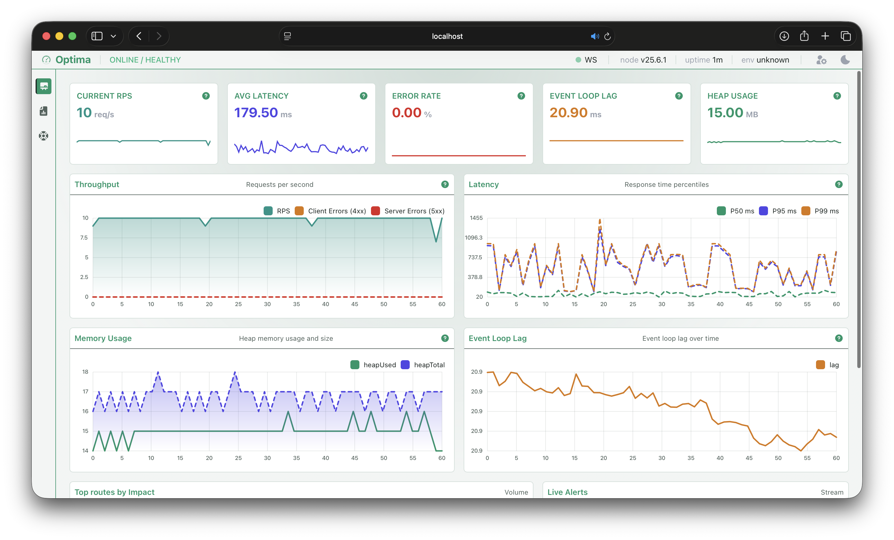
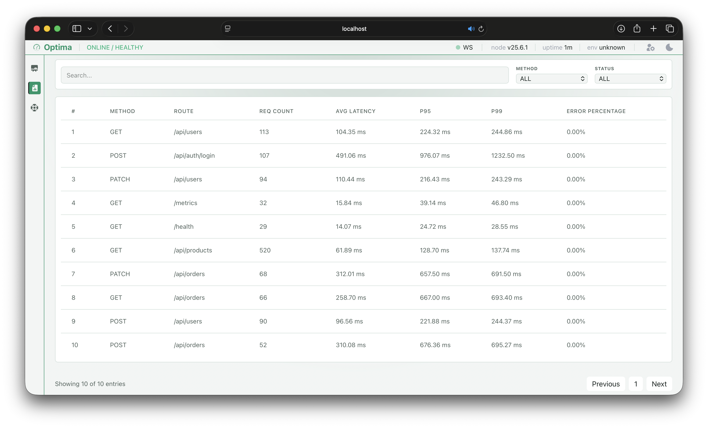
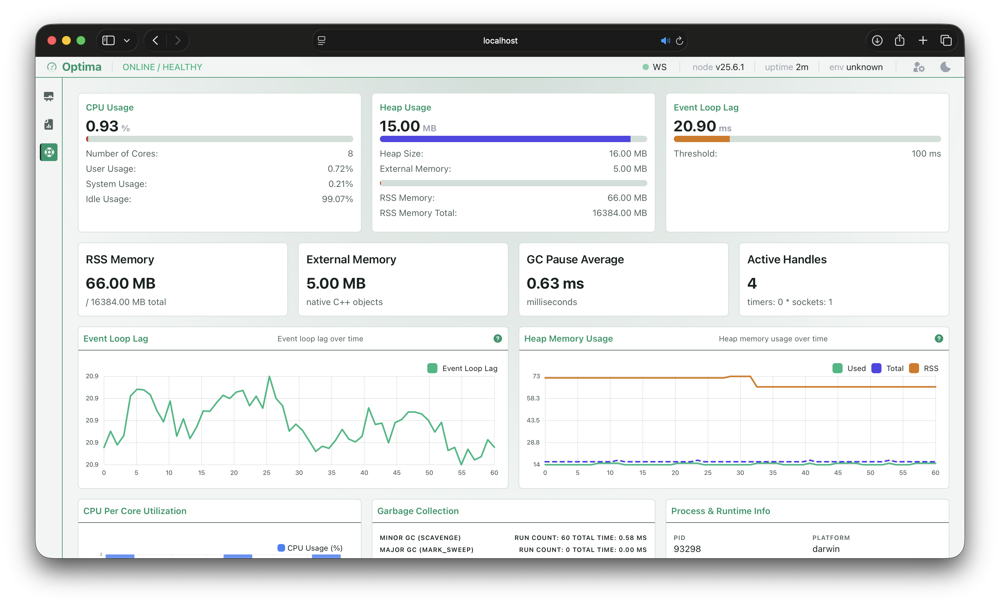
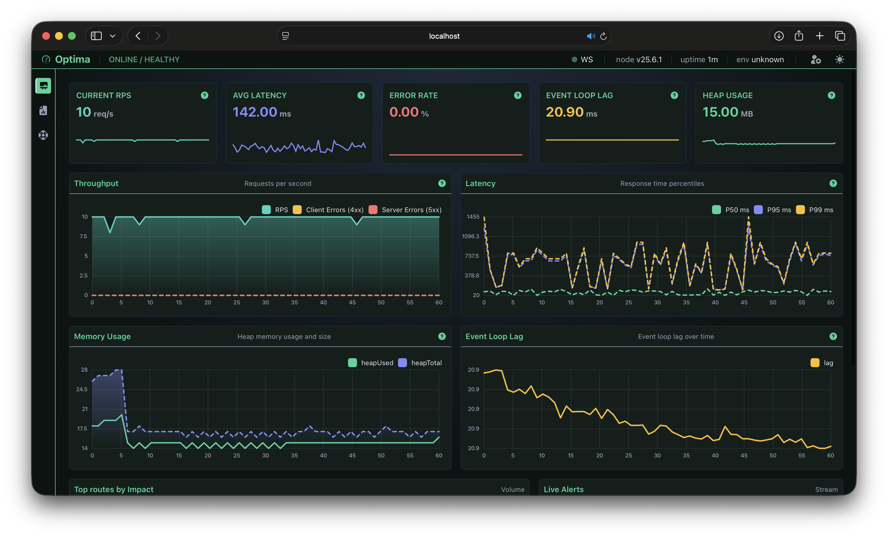

<div align="center">

<h1>Optima APM</h1>


<p><b>Lightweight, real-time Telemetry & Application Performance Monitoring for Node.js</b></p>

[](https://www.npmjs.com/package/apm-optima)
[](https://github.com/Nosalis1/Optima/blob/main/LICENSE)
[](https://nodejs.org)
[](https://www.npmjs.com/)
[](http://makeapullrequest.com)

<br/>

<a href="#key-features">Key Features</a> •
<a href="#architecture">Architecture</a> •
<a href="#quick-start">Quick Start</a> •
<a href="#configuration-options">Configuration</a> •
<a href="#dashboard-preview">Dashboard</a>

</div>

---

## Overview

**Optima** is an in-memory Application Performance Monitoring (APM) library designed for modern Node.js web services. It intercepts HTTP requests, tracks Event Loop lag, computes latency percentiles in real time, and identifies performance anomalies—all while serving an embedded React Dashboard with zero external database dependencies.

> Built for **Express.js** and **NestJS** applications with low runtime overhead.

---

## Key Features

- **Real-time Latency Metrics:** On-the-fly computation of $P_{50}$, $P_{95}$, and $P_{99}$ percentiles.
- **Z-Score Anomaly Detection:** Statistical detection of unexpected response time spikes.
- **In-Memory Storage:** Efficient metric aggregation using typed array (`Uint32Array`) histogram buckets and circular ring buffers.
- **Embedded React Dashboard:** Zero-config static dashboard served directly through your primary Node.js HTTP server.
- **Framework Agnostic Core:** Native support for both **Express** (middleware) and **NestJS** (interceptors/modules).
- **Live Updates:** Low-latency WebSocket layer pushing live metrics straight to the UI.

---

## Dashboard Preview

<div align="center">
  <table border="0">
    <tr>
      <td width="33.3%"></td>
      <td width="33.3%"></td>
      <td width="33.3%"></td>
    </tr>
  </table>
  <td width="33.3%"></td>
  <p><i>Real-time monitoring interface served directly via <code>/optima-metrics</code>.</i></p>
</div>

---

## Architecture

Optima is structured as a **Monorepo** managed with `npm workspaces`:

```
├── packages/
│   └── core/          # Telemetry engine, interceptors, and WebSocket adapters (apm-optima/core)
│   └── dashboard/     # Next.js React Dashboard (exported statically into apm-optima/core)
├── apps/              # Integration & demo application (Express & NestJS)
```

---

## Quick Start

### Installation

```bash
npm i apm-optima
# or
pnpm add apm-optima
# or
yarn add apm-optima
```

### Express.js Integration

Attach Optima using setupOptima and hook the HTTP server instance:
```ts
const express = require('express');
const { setupOptima } = require('apm-optima/express');

const app = express();
app.use(express.json());

// Initialize Optima telemetry & embed UI
const optima = setupOptima(app, {
  dashboardPath: '/optima-metrics',
  publisher: {
    intervalMs: 1000,
    slowLatencyThresholdMs: 500,
  },
});

app.get('/api/v1/resource', (req, res) => {
  res.json({ status: 'ok' });
});

const server = app.listen(3000, () => {
  console.log('Server running on port 3000');
});

// Attach WebSocket server & background timers
const stopMetrics = optima.attachServer(server);
```

### NestJS Integration

Import MetricsModule into your root application module:
```ts
import { Module } from '@nestjs/common';
import { MetricsModule } from 'apm-optima/nest';

@Module({
  imports: [
    MetricsModule.forRoot({
      dashboardPath: '/optima-metrics',
      publisher: {
        intervalMs: 1000,
        slowLatencyThresholdMs: 500,
      },
      excludePaths: ['/health'],
    }),
  ],
})
export class AppModule {}
```

### Configuration Options

| Option | Type | Default | Description |
| --- | --- | --- | --- |
| `dashboardPath` | `string \| false` | `/optima-metrics` | Route endpoint for serving the embedded UI (`false` to disable). |
| `simulation` | `false \| { intervalMs: number, requestsPerTick: number }` | `false` | Generates synthetic traffic for local testing and load simulation. |
| `publisher.intervalMs` | `number` | `1000` | Broadcast interval (in ms) for pushing telemetry updates over WebSockets. |
| `publisher.slowLatencyThresholdMs` | `number` | `500` | Latency limit in milliseconds above which requests are flagged as slow. |
| `publisher.eventLoopLagThresholdMs` | `number` | `50` | Event Loop delay threshold in milliseconds for triggering lag alerts. |
| `publisher.eventLoopResolutionMs` | `number` | `10` | Sampling resolution interval for computing Event Loop delay. |
| `tickIntervalMs` | `number` | `250` | Resolution interval for recalculating internal metrics and buckets. |
| `excludePaths` | `string[]` | `['/_next/*','/_next/**','*.map','/favicon.ico','/metrics_pack']` | Array of route patterns or paths to skip from metric collection (e.g., `/health`). |
| `consoleLog` | `boolean` | `false` | Enables logging internal system events and alerts to `stdout`. |
| `ringBufferSize` | `number` | `60` | Capacity of the internal ring buffer used for storing time-series data. |
| `alertBufferSize` | `number` | `100` | Maximum capacity of the buffer holding recent alerts and detected anomalies. |

## Contributing

Contributions, issues, and feature requests are welcome!  
Feel free to check out the [issues page](https://github.com/Nosalis1/Optima/issues).

Please read our [Contributing Guidelines](CONTRIBUTING.md) before submitting a Pull Request or opening an issue.

## License

Distributed under the MIT License. See [`LICENSE`](LICENSE) for more information.
