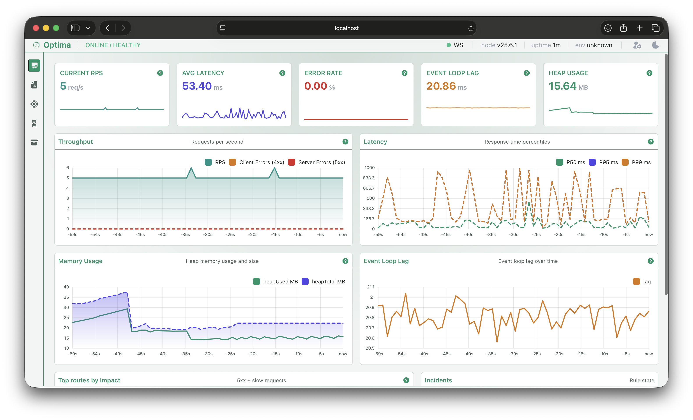
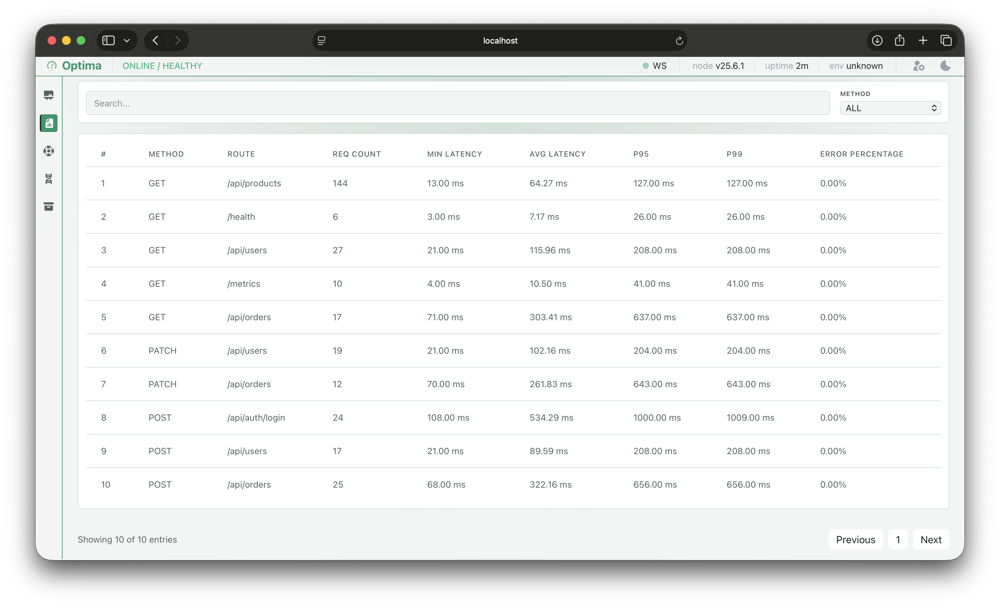
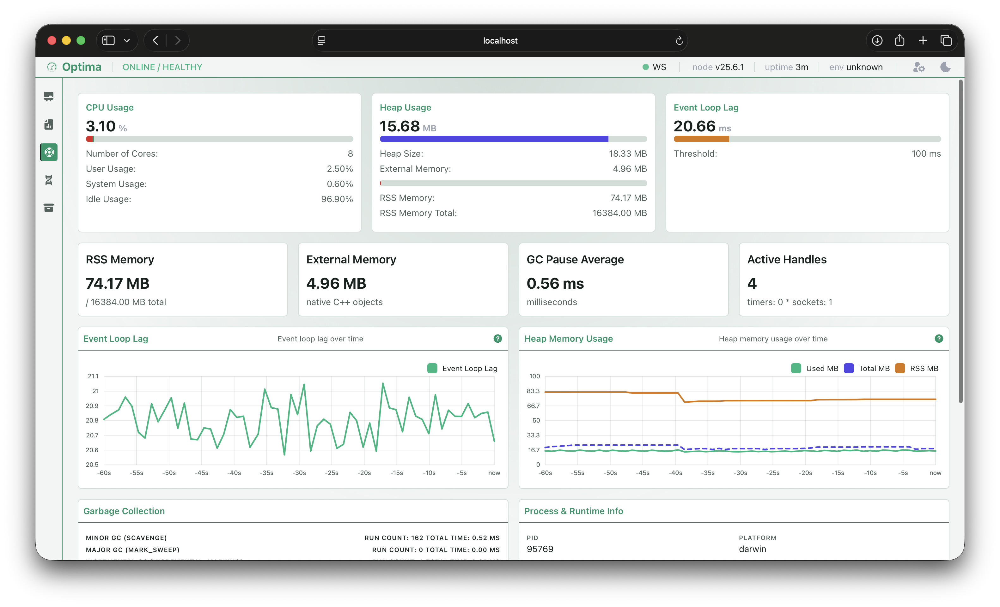
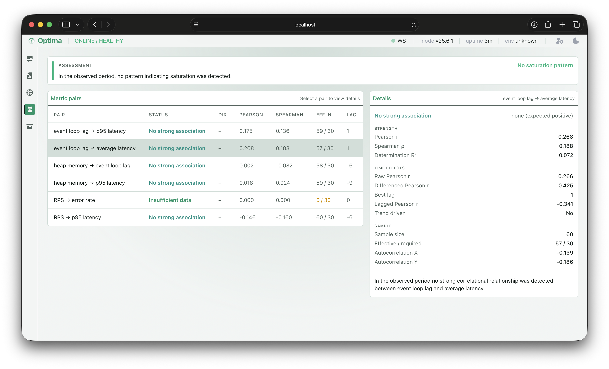
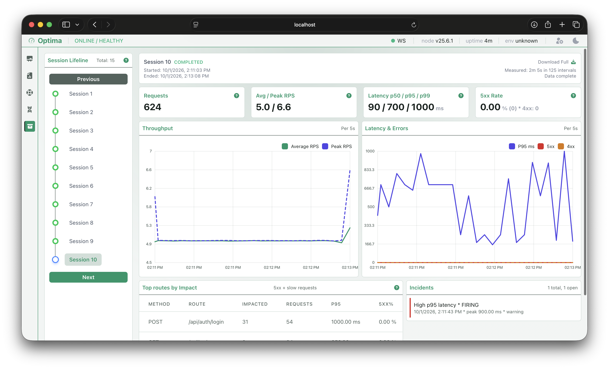
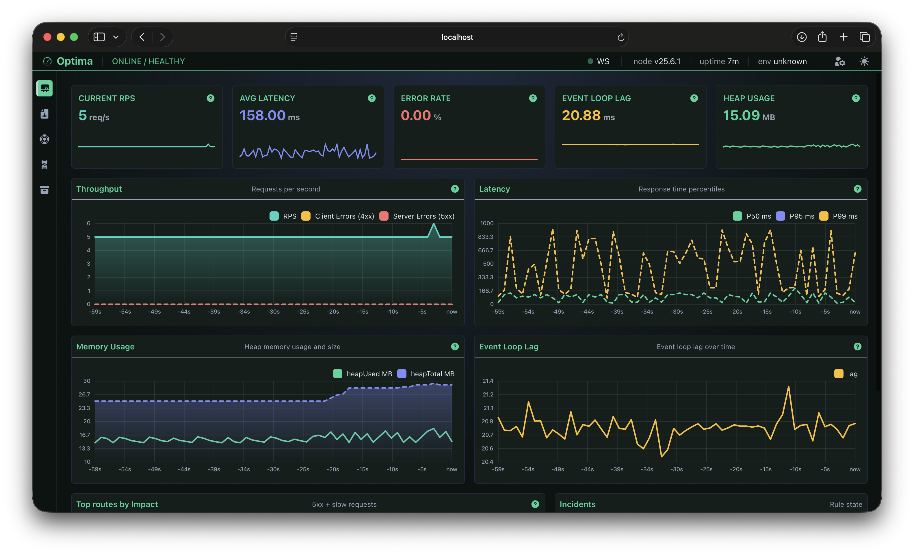

<div align="center">

<h1>Optima APM</h1>


<p><b>Lightweight, real-time Telemetry & Application Performance Monitoring for Node.js</b></p>

[](https://www.npmjs.com/package/apm-optima)
[](https://github.com/Nosalis1/Optima/blob/main/LICENSE)
[](https://nodejs.org)
[](https://www.npmjs.com/)
[](http://makeapullrequest.com)

<br/>

<a href="#key-features">Key Features</a> •
<a href="#architecture">Architecture</a> •
<a href="#quick-start">Quick Start</a> •
<a href="#configuration-options">Configuration</a> •
<a href="#dashboard-preview">Dashboard</a>

</div>

---

## Overview

**Optima** is an in-memory Application Performance Monitoring (APM) library designed for modern Node.js web services. It intercepts HTTP requests, tracks Event Loop lag, computes latency percentiles in real time, and identifies performance anomalies—all while serving an embedded React Dashboard with zero external database dependencies.

> Built for **Express.js** and **NestJS** applications with low runtime overhead.

---

## Key Features

- **Real-time Latency Metrics:** On-the-fly computation of $P_{50}$, $P_{95}$, and $P_{99}$ percentiles.
- **Z-Score Anomaly Detection:** Statistical detection of unexpected response time spikes.
- **In-Memory Storage:** Efficient metric aggregation using typed array (`Uint32Array`) histogram buckets and circular ring buffers.
- **Embedded React Dashboard:** Zero-config static dashboard served directly through your primary Node.js HTTP server.
- **Framework Agnostic Core:** Native support for both **Express** (middleware) and **NestJS** (interceptors/modules).
- **Live Updates:** Low-latency WebSocket layer pushing live metrics straight to the UI.

---

## Dashboard Preview

<div align="center">
  <table border="0">
    <tr>
      <td width="50%"></td>
      <td width="50%"></td>
    </tr>
    <tr>
      <td width="50%"></td>
      <td width="50%"></td>
    </tr>
    <tr>
      <td width="50%"></td>
      <td width="50%"></td>
    </tr>
  </table>
  <p><i>Real-time monitoring interface served directly via <code>/optima-metrics</code>.</i></p>
</div>

---

## Architecture

Optima is structured as a **Monorepo** managed with `npm workspaces`:

```
├── packages/
│   └── core/          # Telemetry engine, interceptors, and WebSocket adapters (apm-optima/core)
│   └── dashboard/     # Next.js React Dashboard (exported statically into apm-optima/core)
├── apps/              # Integration & demo application (Express & NestJS)
```

---

## Quick Start

### Installation

```bash
npm i apm-optima
# or
pnpm add apm-optima
# or
yarn add apm-optima
```

### Express.js Integration

Attach Optima using setupOptima and hook the HTTP server instance:
```ts
const express = require('express');
const { setupOptima } = require('apm-optima/express');

const app = express();
app.use(express.json());

// Initialize Optima telemetry & embed UI
const optima = setupOptima(app, {
      dashboard: {
        path: '/optima-metrics',
    },
    publisher: {
        intervalMs: 1000,
    },
    persistence: {
        baseDir: 'metrics_data',
        maxBufferSize: 1000,
        persistRawRequests: true,
    },
    tickIntervalMs: 250,
});

app.get('/api/v1/resource', (req, res) => {
  res.json({ status: 'ok' });
});

const server = app.listen(3000, () => {
  console.log('Server running on port 3000');
});

// Attach WebSocket server & background timers
const stopMetrics = optima.attachServer(server);
```

### NestJS Integration

Import MetricsModule into your root application module:
```ts
import { Module } from '@nestjs/common';
import { MetricsModule } from 'apm-optima/nest';

@Module({
  imports: [
    MetricsModule.forRoot({
      dashboard: {
          path: '/optima-metrics',
      },
      simulation: {
          intervalMs: 200,
          requestsPerTick: 250,
      },
      publisher: {
          intervalMs: 1000,
      },
      persistence: {
          baseDir: 'metrics_data',
          maxBufferSize: 1000,
          persistRawRequests: true,
      },
      tickIntervalMs: 250,
    }),
  ],
})
export class AppModule {}
```

## Configuration Options

Every option is optional. Sections are merged field by field with the defaults, so setting one field keeps the defaults of the others. Values outside the allowed range are clamped. `persistence`, `dashboard` and `simulation` accept `false` (disabled), `true` (enabled with defaults) or an object.

| Option | Type | Default | Description |
| --- | --- | --- | --- |
| `applicationVersion` | `string` | `1.0.0` | Version of the running application, stored with application events. |
| `logging.consoleLog` | `boolean` | `true` | Logs every measured request to `stdout`. |
| `collection.excludePaths` | `string[]` | `[]` | Glob patterns of routes that are not measured (`*` within one segment, `**` across segments). |
| `collection.includeDefaultExcludes` | `boolean` | `true` | Also excludes `/_next/**`, `**/*.map`, `**/*.js`, `**/*.css`, `/favicon.ico`. The dashboard path is always excluded. |
| `collection.bucketIntervalMs` | `number` | `1000` | Length of one measurement interval (bucket). |
| `collection.maxEndpointsPerBucket` | `number` | `200` | Distinct routes per interval; the rest is grouped as overflow. |
| `collection.eventLoopResolutionMs` | `number` | `20` | Sampling resolution of the event loop delay monitor. |
| `thresholds.slowLatencyMs` | `number` | `500` | A request slower than this counts as slow (analytics, impact, incidents). |
| `thresholds.eventLoopLagMs` | `number` | `100` | Event loop lag limit used by health and incidents. |
| `cache.liveBuckets` | `number` | `300` | Closed intervals kept in memory; raised automatically to cover the correlation and incident windows. |
| `cache.viewWindowBuckets` | `number` | `60` | Intervals shown in live charts, analytics and health. |
| `persistence` | `false \| object` | enabled | Stores intervals, events and findings as NDJSON files. |
| `persistence.baseDir` | `string` | `./metrics_data` | Directory for persisted data and the session manifest. |
| `persistence.persistRawRequests` | `boolean` | `true` | Also stores individual 4xx/5xx requests. |
| `persistence.maxBufferSize` | `number` | `1000` | Buffered error requests before a flush. |
| `persistence.archiveIntervalMs` | `number` | `86400000` | How often closed daily files are compressed. |
| `persistence.heartbeatIntervalMs` | `number` | `30000` | How often the running session record is updated. |
| `persistence.shutdownDrainTimeoutMs` | `number` | `5000` | Max wait for in-flight requests on shutdown. |
| `persistence.writer.maxQueue` / `maxRetries` / `retryDelayMs` | `number` | `1000` / `3` / `100` | Write queue capacity and retry policy. |
| `incidents.windowIntervals` | `number` | `60` | Intervals in one evaluated window. |
| `incidents.minRequests` | `number` | `100` | Requests needed in a window for it to be valid. |
| `incidents.serverErrorRate` | `number` | `0.05` | 5xx share that breaches the error rule. |
| `incidents.recoveryRatio` | `number` | `0.5` | Recovery requires values below `threshold × ratio`. |
| `incidents.pendingForMs` / `recoveryForMs` / `resolvedHoldMs` | `number` | `30000` / `60000` / `30000` | How long a breach must last, how long recovery must last, how long RESOLVED is shown. |
| `incidents.historySize` | `number` | `100` | Incidents kept in memory. |
| `correlation.minCorrelation` / `alpha` / `power` | `number` | `0.5` / `0.05` / `0.8` | Used to compute the required sample size. |
| `correlation.strongThreshold` | `number` | `0.7` | Coefficient above which an association is strong. |
| `correlation.maxLag` | `number` | `10` | Largest lag (in intervals) checked. |
| `correlation.maxWindow` | `number` | `60` | Intervals in the analysed window. |
| `correlation.minCoverage` | `number` | `0.5` | Minimum share of valid intervals in the window. |
| `correlation.evaluateEveryIntervals` | `number` | `10` | Evaluate (and store a finding) every N intervals. |
| `dashboard` | `false \| object` | enabled | Embedded UI. |
| `dashboard.path` | `string` | `/optima-metrics` | Route of the UI; session export is served at `<path>/session/:n/export`. |
| `dashboard.liveWindow` | `number` | `60` | Intervals sent in each live update. |
| `dashboard.backfillLimit` | `number` | `1000` | Intervals per backfill answer (capped at 600). |
| `dashboard.maxBackfillAgeMs` | `number` | `86400000` | Oldest data a backfill may read. |
| `dashboard.topImpactRoutes` | `number` | `10` | Routes in the impact table. |
| `dashboard.analyticsPageSize` | `number` | `50` | Rows per analytics page. |
| `dashboard.sessionSummaryWindowHours` | `number` | `24` | Hours covered by a session summary. |
| `transport.socketPath` | `string` | `/socket.io/` | Socket.IO path (Express only; Nest uses the default). |
| `transport.cors` | `string \| boolean` | `*` | Allowed origin for the dashboard socket. |
| `transport.pingTimeoutMs` / `maxHttpBufferSize` | `number` | `5000` / `1048576` | Socket.IO connection settings (Express only). |
| `publisher.intervalMs` | `number` | `1000` | How often data is pushed to the dashboard. |
| `tickIntervalMs` | `number` | `250` | Internal timer that closes intervals and runs evaluations. |
| `simulation` | `false \| object` | `false` | Synthetic traffic for local testing (`intervalMs` `100`, `requestsPerTick` `20`). |


## Contributing

Contributions, issues, and feature requests are welcome!  
Feel free to check out the [issues page](https://github.com/Nosalis1/Optima/issues).

Please read our [Contributing Guidelines](CONTRIBUTING.md) before submitting a Pull Request or opening an issue.

## License

Distributed under the MIT License. See [`LICENSE`](LICENSE) for more information.
